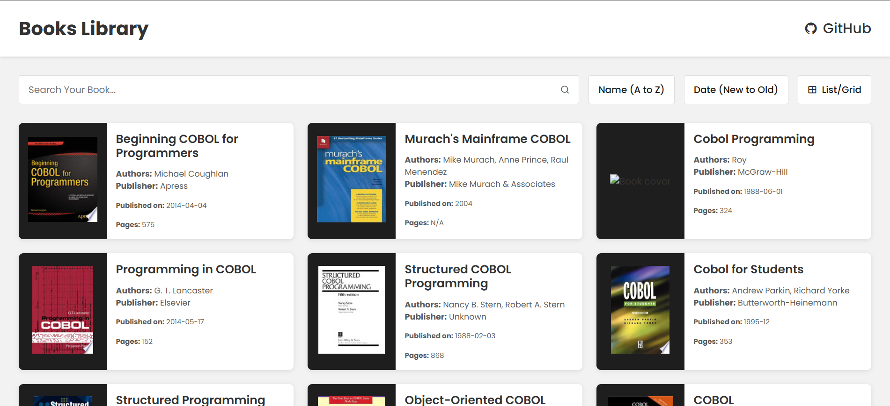

# 📚 Book Library



Welcome to the **Book Library** project! This web application allows users to browse, search, and explore book details fetched from an external API. Built with **HTML, CSS and JavaScript**, this project provides a smooth and responsive user experience.

## 🚀 Features

- **Fetch Books**: Load books dynamically from an external API with pagination support.
- **Search Functionality**: Search for books by title or author in real-time.
- **Sorting Options**: Sort books by title or publication date.
- **Toggle View**: Switch between grid and list views for better readability.
- **Detailed View**: Click on a book to view its details in a new tab.
- **Responsive Design**: Fully optimized for both desktop and mobile devices.

## 📂 Getting Started

### Prerequisites

Ensure you have the following before proceeding:

- A modern web browser (Chrome, Firefox, Edge, etc.)
- An active internet connection to fetch book data

### Installation

1. Clone the repository:
   ```sh
   git clone https://github.com/ravirajbhardwaj/JavaScriptProjects/bookLibrary
   cd bookLibrary
   ```

## 📦 Dependencies

- [Axios](https://axios-http.com/) - A promise-based HTTP client for API requests.

## 🤝 Contributing

We welcome contributions! To contribute:

1. Fork the repository.
2. Create a feature branch.
3. Commit changes and push to your branch.
4. Submit a pull request for review.

## 📜 License

This project is licensed under the **MIT License**. See the [LICENSE](LICENSE) file for details.

## 🙌 Acknowledgements

- [Free API](https://api.freeapi.app/) - API used for fetching book data.

---

Happy coding! 🚀
